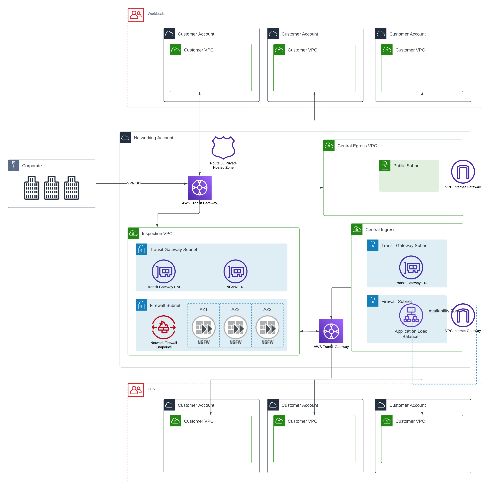

### Choices
* Hub and Spoke (star) topology
* Separate Hubs (Network Account) for production and non-production
* Customers will receive one account per required environment
* Shared ingress, egress, and inspection
* Management of VPCs and routing will remain the repsonsibility of Core Cloud
* VPC will not be a set size
* No overlapping IP ranges
* VPC peering can be used to peer VPC within the same account

### Presumptions
* All external ingress will be via NGFWs
* TDAs may require all of their east-west traffic to also run through NGFWs and this should be managed by
policy and applied at an OU level (see [Account Strategy](../governance/)).

### (TODO)
List how this meets NCSC recommendations or any further required considerations
### Diagram
