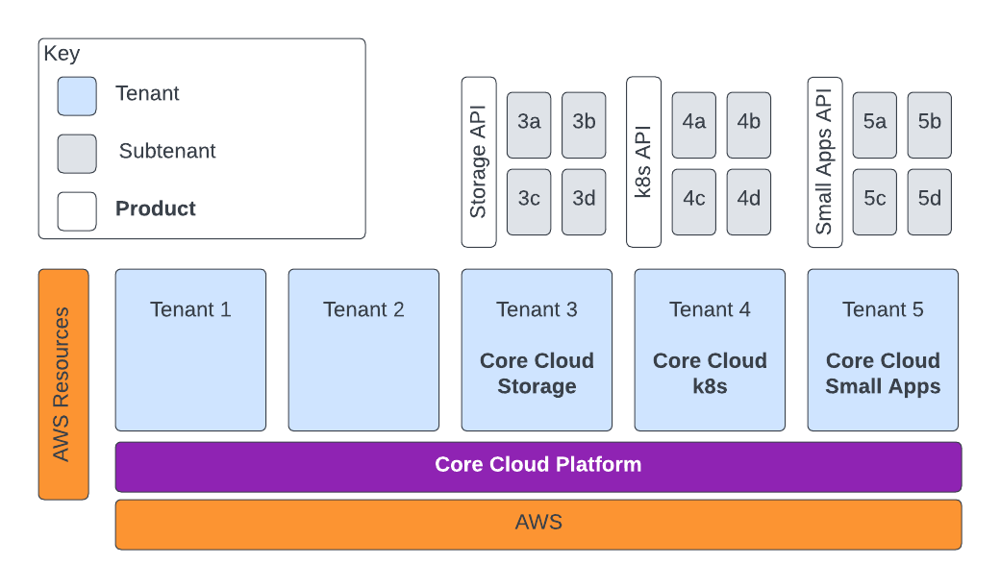

### Products
* CC Platform
* CC Storage
  Provides and manages resources such as s3 and RDS
* CC k8s
  Operates EKS clusters with [AWS Service Operator](https://aws.amazon.com/blogs/opensource/aws-service-operator-kubernetes-available/)  
* CC Small Apps
  Elastic Beanstalk? 
### Assertions (to be validated)
* Only tenants have a relationship with the platform product
* Subtenants only have a relationship with their respective product and not with the platform product.
* Tenants have access to AWS resources (as allowed by policy)
* Each product has it's own shared responsibility model.
* Tenants can only subsume the customer's portion of the platforms shared responsibility model
* Each product will supply it own API
* Each product will have it's own operating model
* Subtenants will only be able to access the resources provided by their product
* Products are only responsible for the isolation of their direct tenant/subtenant i.e their customer
* Subtenants will not receive individual AWS accounts.

### To Clarify
Delivery teams can be a customer of more than one Core Cloud product

For example, a team wants to run ec2 instances, lamdas and manage their own databases but don't want to run their own EKS. They could be a customer of Core Cloud Platform and Core Core Cloud k8s (i.e. both a tenant and subtenant).

